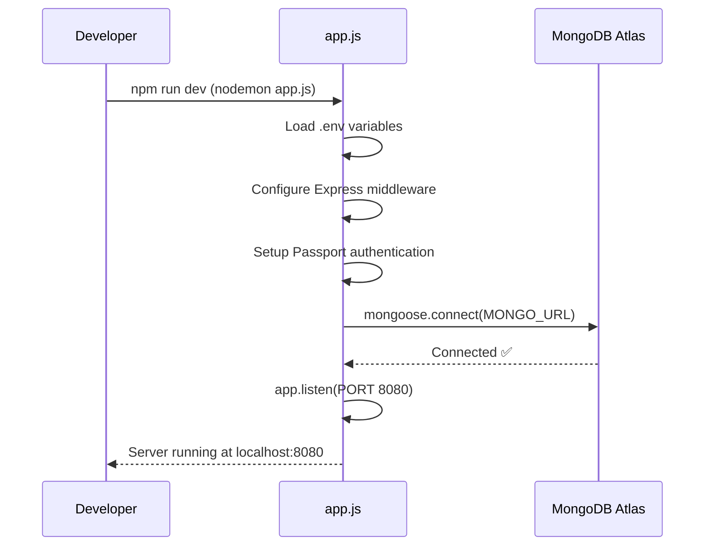
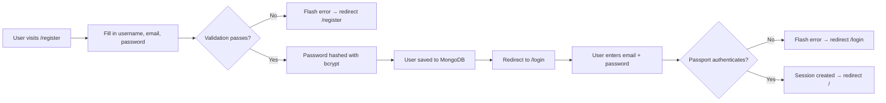
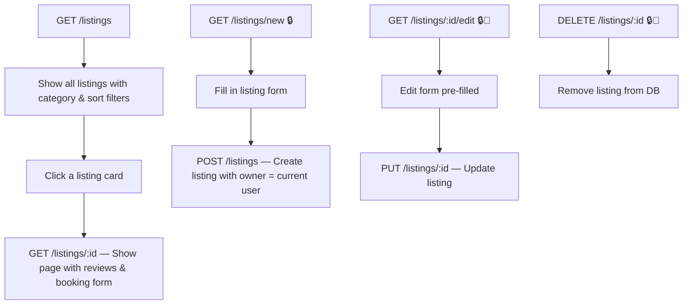
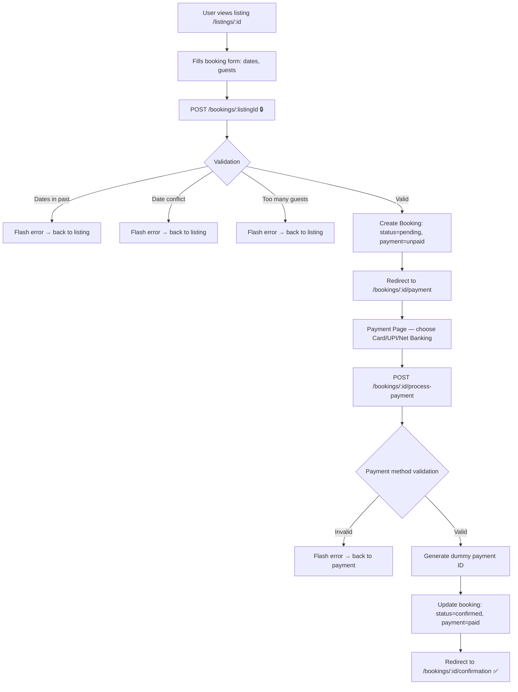

# UrbanBUNK — Project Workflow & Architecture

**UrbanBUNK** is a full-stack, web-based accommodation booking platform (similar to Airbnb) built with Node.js, Express, MongoDB, and EJS templates.

---

## Tech Stack

| Layer | Technology |
|---|---|
| **Runtime** | Node.js |
| **Framework** | Express.js |
| **Database** | MongoDB Atlas (via Mongoose ODM) |
| **Templating** | EJS (Embedded JavaScript) |
| **Authentication** | Passport.js (Local Strategy) + bcrypt for password hashing |
| **Sessions** | express-session + connect-mongo (stored in MongoDB) |
| **Styling** | Vanilla CSS ([style.css](file:///d:/MINI-PR-UB-main/public/css/style.css)) |
| **Dev Server** | Nodemon (auto-restart on file changes) |

---

## Project Structure

```
MINI-PR-UB-main/
├── app.js                  ← Entry point — sets up Express, middleware, routes, DB
├── package.json            ← Dependencies & scripts
├── .env                    ← Environment variables (MONGO_URL, SESSION_SECRET)
│
├── config/                 ← Configuration
│   ├── passport.js         ← Passport local strategy setup
│   ├── database.js         ← DB connection config
│   └── ...
│
├── models/                 ← Mongoose schemas (data layer)
│   ├── User.js             ← User model (username, email, hashed password)
│   ├── listing.js          ← Property listing model
│   ├── Booking.js          ← Booking model (with payment fields)
│   ├── Review.js           ← Review model (rating + comment)
│   └── favorite.js         ← Favorites model
│
├── routes/                 ← Express route handlers (controller layer)
│   ├── auth.js             ← Register / Login / Logout
│   ├── home.routes.js      ← Home page (/)
│   ├── index.routes.js     ← Listings CRUD (/listings)
│   ├── bookings.routes.js  ← Bookings + Payment flow
│   ├── reviews.routes.js   ← Create / Delete reviews
│   ├── dashboard.routes.js ← Host dashboard (stats, manage bookings)
│   ├── favorites.routes.js ← Add / Remove / View favorites
│   └── search.routes.js    ← Search listings
│
├── middleware/
│   └── auth.js             ← isAuthenticated & isOwner middleware
│
├── views/                  ← EJS templates (view layer)
│   ├── home.ejs            ← Landing page
│   ├── partials/           ← header.ejs, footer.ejs (shared layout)
│   ├── auth/               ← login.ejs, register.ejs
│   ├── listings/           ← index.ejs, show.ejs, new.ejs, edit.ejs
│   ├── bookings/           ← index.ejs, payment.ejs, confirmation.ejs
│   ├── dashboard/          ← index.ejs, listings.ejs, bookings.ejs
│   ├── search/             ← results.ejs
│   └── favorites.ejs
│
├── public/css/style.css    ← Global styles
│
└── init/                   ← Database seeding
    ├── data.js             ← Sample listing data (with categories)
    └── index.js            ← Seed script (node init/index.js)
```

---

## How It Works — Complete Flow

### 1. Application Startup



**What happens in [app.js](file:///d:/MINI-PR-UB-main/app.js):**
1. Loads environment variables from `.env`
2. Sets up Express with middleware: URL encoding, JSON parsing, method override, static files
3. Configures sessions (stored in MongoDB via `connect-mongo`)
4. Initializes Passport for authentication
5. Makes `currentUser`, `flash messages`, and `categories` available to all EJS templates
6. Mounts all route handlers
7. Connects to MongoDB Atlas and starts listening on port **8080**

---

### 2. Authentication Flow



| Route | Method | What it does |
|---|---|---|
| `/register` | GET | Show registration form |
| `/register` | POST | Validate → hash password → save User → redirect to login |
| `/login` | GET | Show login form |
| `/login` | POST | Passport local strategy → authenticate by email + password |
| `/logout` | GET | Destroy session → redirect home |

> [!IMPORTANT]
> Passwords are **never stored in plain text**. The [User model](file:///d:/MINI-PR-UB-main/models/User.js) uses a `pre('save')` hook to auto-hash passwords with bcrypt (salt rounds = 10).

---

### 3. Listings Flow (CRUD)



**Key features:**
- **Categories**: Beach, Mountain, City, Countryside, Lake, Desert, Island, Cabin
- **Filtering**: `GET /listings?category=Beach` filters by category
- **Sorting**: `?sort=price_low` or `?sort=price_high`
- **Authorization**: Only the listing **owner** can edit or delete (enforced by `isOwner` middleware)
- 🔒 = requires login, 👤 = requires ownership

---

### 4. Booking + Payment Flow (Core Feature)



**Booking data model** ([Booking.js](file:///d:/MINI-PR-UB-main/models/Booking.js)):
- Links a **user** to a **listing** with check-in/out dates
- **Status**: `pending` → `confirmed` / `cancelled` / `rejected`
- **Payment**: method (card/upi/netbanking), paymentId, paymentStatus (unpaid/paid/refunded)

**Payment gateway** (dummy):
- Validates card (16 digits), UPI (must contain @), or bank selection
- Generates a random payment ID: `PAY_XXXX...`
- No real payment processor; designed for demo purposes

**My Bookings page** (`GET /bookings`):
- **Upcoming** tab: pending/confirmed bookings with future check-in dates
- **Past** tab: completed stays
- **Cancelled** tab: cancelled or rejected bookings
- Users can cancel bookings (auto-refund if paid)

---

### 5. Reviews Flow

| Route | Method | What it does |
|---|---|---|
| `POST /listings/:id/reviews` 🔒 | POST | Submit a rating (1-5) + comment |
| `POST /listings/:id/reviews/:reviewId/delete` 🔒 | POST | Delete own review |

- **One review per user per listing** (enforced by unique compound index)
- Reviews are displayed on the listing's show page with an average rating

---

### 6. Favorites Flow

| Route | Method | What it does |
|---|---|---|
| `GET /favorites` | GET | View all favorited listings |
| `POST /favorites/:listingId` | POST | Add a listing to favorites (JSON API) |
| `GET /favorites/check/:listingId` | GET | Check if listing is favorited (JSON API) |
| `DELETE /favorites/by-listing/:listingId` | DELETE | Remove from favorites by listing ID |

---

### 7. Search Flow

- **Route**: `GET /search?location=...&checkin=...&checkout=...&guests=...`
- Searches across listing **title**, **location**, and **country** (case-insensitive regex)
- Filters by **guest capacity** and **date availability**
- Only returns **available** listings

---

### 8. Host Dashboard

The dashboard is the **owner's control panel** for managing their properties.

| Route | What it shows |
|---|---|
| `GET /dashboard` 🔒 | Overview: total listings, bookings, revenue, avg rating |
| `GET /dashboard/listings` 🔒 | Manage own listings (toggle availability) |
| `GET /dashboard/bookings` 🔒 | Manage incoming bookings (confirm/reject) with tabs |
| `POST /dashboard/bookings/:id/confirm` 🔒 | Confirm a pending booking |
| `POST /dashboard/bookings/:id/reject` 🔒 | Reject a booking |
| `POST /dashboard/listings/:id/toggle` 🔒 | Toggle listing active/inactive |

---

## Middleware

| Middleware | File | Purpose |
|---|---|---|
| `isAuthenticated` | [auth.js](file:///d:/MINI-PR-UB-main/middleware/auth.js) | Redirects to `/login` if user is not logged in |
| `isOwner` | [auth.js](file:///d:/MINI-PR-UB-main/middleware/auth.js) | Checks if logged-in user owns the listing (for edit/delete) |

---

## Database Seeding

To populate the database with sample listings:

```bash
node init/index.js
```

This runs [init/index.js](file:///d:/MINI-PR-UB-main/init/index.js) which:
1. Connects to MongoDB
2. Clears all existing listings (`deleteMany`)
3. Inserts sample data from [init/data.js](file:///d:/MINI-PR-UB-main/init/data.js) (properties across 8 categories)

---

## How to Run

```bash
# 1. Install dependencies
npm install

# 2. Start dev server (with auto-reload)
npm run dev

# 3. Open in browser
# → http://localhost:8080
```

> [!NOTE]
> The `.env` file is already included with a MongoDB Atlas connection string and session secret, so no additional configuration is needed.

---

## Complete Request Lifecycle

```mermaid
flowchart LR
    A[Browser Request] --> B[Express app.js]
    B --> C[Session Middleware]
    C --> D[Passport Middleware]
    D --> E[Flash + Locals Middleware]
    E --> F[Route Handler]
    F --> G[Auth Middleware if needed]
    G --> H[Mongoose Model ↔ MongoDB]
    H --> I[EJS Template Rendered]
    I --> J[HTML Response to Browser]
```



Every request flows through: **Express → Session → Passport → Flash/Locals → Route → Middleware → Model → View → Response**
